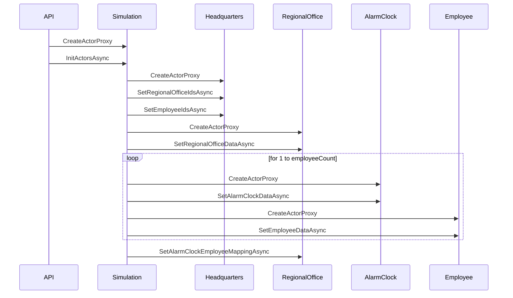
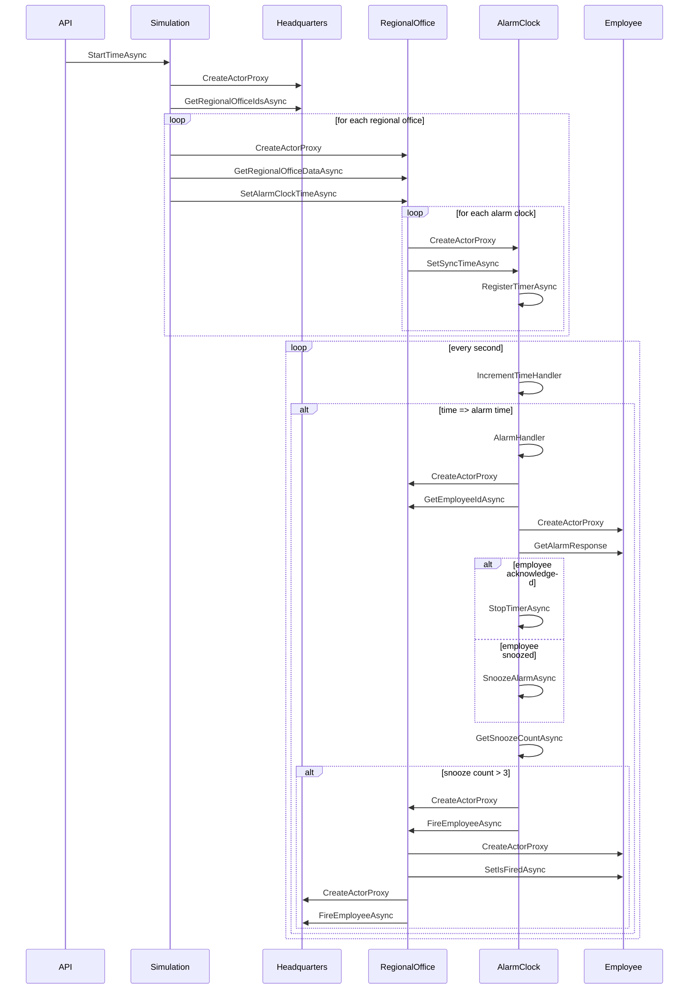

# Dapr Actor Demos

## EvilCorp Actor Demo

A fictional company called EvilCorp 😈 wants their employees to be more productive and have decided to implement a system with smart alarm clocks that will wake up their employees at 7am. If the employees have not acknowledged the alarm within 3 snoozes, the alarm will send a message to the headquarters to lay off the employee 😱.

The front-end of the demo is a basic HTML page that uses [p5js](https://p5js.org/) to draw the information on the page. The back-end is a [Dapr](https://dapr.io/) application written in ASP.NET that uses actors for the headquarters, the regional office, the employees, and the alarm clocks. Communication between the back-end and the front-end is realized with [Ably](https://ably.com/).


When the demo is run you'll see a realtime display of the alarm clocks in the EvilCorp Dashboard. Alarm clocks are represented by a square. The color of the square indicates the state of the alarm clock:

- Green: Alarm has been acknowledged on time.
- Blue: Alarm has been snoozed.
- Red: Alarm has been snoozed for too long, employee will be laid off.

#### InitActors sequence diagram



#### StartTime sequence diagram



### Prerequisites for running the demo locally

- [Docker Desktop](https://www.docker.com/products/docker-desktop/)
- [Dapr CLI](https://docs.dapr.io/getting-started/install-dapr-cli/)
- [Ably account](https://ably.com/signup) (free tier is sufficient)

### Configuring the demo

#### Back-end

1. Copy the [Ably API Root key](https://ably.com/docs/ids-and-keys#api-key) from the Ably portal.
2. Rename the `EvilCorpDemo/EvilCorp.Api/secrets.json.example` file to `EvilCorpDemo/EvilCorp.Api/secrets.json` and paste Ably API key in the `AblyApiKey` field:

    ```json
    {
        "AblyApiKey": "YOUR_ABLY_API_KEY_HERE"
    }
    ```

    > The `secrets.json` file is excluded from source control by the `.gitignore` file, so you don't have to worry the API key will be exposed to the public.

3. Use the terminal to navigate to the `EvilCorpDemo` folder and build the solution:

    ```bash
    dotnet build
    ```

#### Front-end

1. Rename the `EvilCorpDemo/EvilCorp.FrontEnd/secrets.json.example` file to `EvilCorpDemo/EvilCorp.FrontEnd/secrets.json` and paste Ably API key in the `AblyApiKey` field:

    ```json
    {
        "AblyApiKey": "YOUR_ABLY_API_KEY_HERE"
    }
    ```

2. Use the terminal to navigate to the `EvilCorpDemo/EvilCorp.FrontEnd` folder and install the dependencies for the front-end:

    ```bash
    npm install
    ```

### Running the demo

1. Use the terminal to navigate to the `EvilCorpDemo` folder.
2. Use Dapr multi-app run to start both the back-end and front-end with a single command:

    ```bash
    dapr run -f .
    ```

    The `EvilCorpDemo/dapr.yaml` file contains the configuration of the apps that will be started.

3. Open the [front-end](http://localhost:5500) in a browser and click the `Connect` button. This establishes a connection with Ably Realtime.
4. Enter the number of employees you want to simulate and click the `Create actors` button. This will create actors for the EvilCorp head quarters, the regional office, the employees and the alarm clocks.
   > Be careful not to create too many employees. The free tier of Ably is rate-limited to handle 70 messages per second. More info in the [Ably limits docs](https://ably.com/docs/general/limits).
5. Click the `Start time` button to start the simulation. This will set the time of all the alarm clocks and after each two seconds 10 minutes will pass in the simulation. Once the alarm clocks reach 7:00, the employee actors will randomly acknowledge or snooze the alarm.

## Basic Actor Samples

The `BasicActorSamples` folder in this repo contains a number of samples that demonstrate the basic functionality of Dapr Actors. The samples are written in C# and use the Dapr Actors .NET SDK.

The Actor interactions are performed via the Dapr HTTP API and are listed in the [basic-actor-samples.http](./BasicActorSamples/basic-actor-samples.http) file.

### HelloWorldActor

The `HelloWorldActor` is a stateless actor and contains two methods that can be invoked.

The `SayHelloWorld` method without parameters:

```bash
GET {{ daprHttp }}/v1.0/actors/HelloWorldActor/user1/method/SayHelloWorld
dapr-app-id: basic-actor-demos
```

The `SayHello` method with a parameter:

```bash
POST {{ daprHttp }}/v1.0/actors/HelloWorldActor/user2/method/SayHello
dapr-app-id: basic-actor-demos
Content-Type: application/json

"Rene"
```

### StatefulActor

The `StatefulActor` is a stateful actor and contains two methods, one to set the state and one to get the state.

```bash
POST {{ daprHttp }}/v1.0/actors/StatefulActor/user2/method/SetGreeting
dapr-app-id: basic-actor-demos
Content-Type: application/json

"Hello from StatefulActor!"
```

```bash
GET {{ daprHttp }}/v1.0/actors/StatefulActor/user2/method/GetGreeting
dapr-app-id: basic-actor-demos
```

The state can also be set via the Dapr Actor state endpoint:

```bash
POST {{ daprHttp }}/v1.0/actors/StatefulActor/user2/state
dapr-app-id: basic-actor-demos
Content-Type: application/json

[
    {
        "operation": "upsert",
        "request": {
            "key": "greeting",
            "value": "Hello from StatefulActor (state endpoint)!"
        }
    }
]
```

And retrieved via the Dapr Actor state endpoint:

```bash
GET {{ daprHttp }}/v1.0/actors/StatefulActor/user2/state/greeting
dapr-app-id: basic-actor-demos
```

### TimerActor

The `TimerActor` is an actor that contains a timer. The timer is started when the `CreateTimer` method is called and will trigger the execution of the `SnoozeHandler` method every 5 seconds.

```bash
POST {{ daprHttp }}/v1.0/actors/TimerActor/alarmclock1/method/CreateTimer
dapr-app-id: basic-actor-demos
```

The timer can be deleted via the Dapr Actor timers endpoint:

```bash
DELETE {{ daprHttp }}/v1.0/actors/TimerActor/alarmclock1/timers/snooze
dapr-app-id: basic-actor-demos
```

### ReminderActor

The `ReminderActor` is an actor that contains a reminder, a stateful version of a timer.

```bash
POST {{ daprHttp }}/v1.0/actors/ReminderActor/alarmclock2/reminders/snooze
dapr-app-id: basic-actor-demos
Content-Type: application/json

{
    "dueTime" : "0h0m3s0ms",
    "period" : "R3/P0Y0M0W0DT0H0M10S"
}
```

The reminder can be deleted via the Dapr Actor reminders endpoint:

```bash
DELETE {{ daprHttp }}/v1.0/actors/ReminderActor/alarmclock2/reminders/snooze
dapr-app-id: basic-actor-demos
```

### ActorToActor

The `ActorToActor` sample demonstrates how to call an actor from another actor. The `CallHelloWorld` method creates a proxy of the `HelloWorldActor` and invokes the `SayHelloWorld` method on it. This requires the Actor ID of the `HelloWorldActor` to be passed as a parameter.

```bash
POST {{ daprHttp }}/v1.0/actors/ActorToActor/id1/method/CallHelloWorld
dapr-app-id: basic-actor-demos
Content-Type: application/json

"helloWorldId1"
```

## Resources

1. [Dapr Actors overview](https://docs.dapr.io/developing-applications/building-blocks/actors/actors-overview/).
2. [Dapr Actors API reference](https://docs.dapr.io/reference/api/actors_api/)

## More information

Any questions or comments about this sample? Join the [Dapr discord](https://bit.ly/dapr-discord) and post a message the `APIS > #actors` channel.
Have you made something with Dapr? Post a message in the `#show-and-tell` channel, we love to see your creations!
